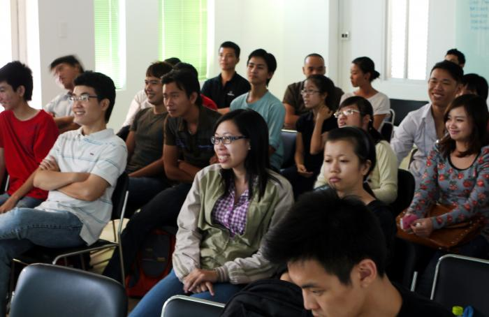

#WORKSHOPS

##WEEK 1/INTRODUCTORY WORKSHOPS

*3/4/5 April, Ho Chi Minh City*

The first week gives Vietnamese designers in Ho Chi Minh City the opportunity to get to know and learn from international designers from Europe. Introductory workshops will offer local designers the chance to dig into new design concepts and learn about new Open Source software tools used in todays European art and design scene. These workshops are a preparation for the second intensive work week. At the end of the week an exhibition dedicated to Open Design will be opened.

Teaching Designers: Pierre Marchand, Femke Snelting, Alexandre Leray, Stephanie Villayphou, Pierre Huyghebaert, David Crossland

Workshop 1: Fonts   

Workshop 2: Vector illustration 

Workshop 3: Lay-out

Date: Sunday April 3

Time: Morning 9am-12pm, Afternoon 2-5pm

Place of workshop: University Ho Chi Minh City (tbd)

##WEEK 1/WORKSHOPS AT COMPANIES AND UNIVERSITIES

*6 April, Ho Chi Minh City*

Teaching Designers: Pierre Marchand, Femke Snelting, Alexandre Leray, Stephanie Villayphou, Pierre Huyghebaert, David Crossland

Monday, 4 April: Visit of universities in HCMC with presentations and introduction of software tools for designers

Tuesday, 5 April: Workshop Sessions and visits to Designer Labs and companies in HCMC

Wednesday, 6 April: Workshop Sessions / Visit to Designer Labs and companies in HCMC

Contact for Interested Companies and Universities
Companies and universities interested in meetings with International designers please contact Dang, Hong Phuc.

##WEEK 2/WORKSHOP 1: FONT DESIGN (TYPOGRAPHY)

*12-15 April, Cantho City*

Teaching Designers: Pierre Marchand, Femke Snelting, Alexandre Leray, Stephanie Villayphou, Pierre Huyghebaert, David Crossland

Description: In this workshop we will look at designing fonts for different use cases be it one the web, be it for mobile devices or be it for print publications. For years the usage of different fonts that could be used on the Internet was often limited due to computer, software and network limitations. Today the possibilities of designers creating interfaces are expanding through projects like the Google Font Project and others. Today many tools are available to design own fonts and develop new streams of income by distributing  artwork. Creating fonts, the art of Typography, for a global audience is a challenge. What if a font would be designed with two or more writing systems in mind from the start? To design a font between European and Asian designers would mean finding a system that can work for both. Working across languages, system vs. element. Licensing. Font = software. Five European designers will work with participants in an intensive and creative atmosphere.

Software used: Inkscape, Gimp, Fontforge, GIT/SVN, FontMatrix, Fonzy/Nancy, ConTeXT

Outcome: A collaborative font-release, available under a free/libre license for download and use.

References: [http://ospublish.constantvzw.org/education/local-universal](http://ospublish.constantvzw.org/education/local-universal)

Time: Morning 9am-12pm, Afternoon 2-5pm

Presentations of outcome: Saturday April 16, 10am-4pm

Place of workshop: MBM Workspace, 93 Mau Than, Xuan Khanh Ward., Ninh Kieu Dist, Can Tho City

Included: Workshop facilities, Internet, software, work place, lunch, coffee snacks, 50%off at Open Design Dinner

Cover fee required

##WEEK2/WORKSHOP 2: COLLABORATIVE PUBLICATION

*11-14 April, Cantho City*

Teaching Designers: Pierre Marchand, Femke Snelting, Alexandre Leray, Stephanie Villayphou, Pierre Huyghebaert, David Crossland

Description: New products and services enter our lives continously – Twitter, Facebook, Android Apps, new operating systems, and consumer products. Designers work everywhere. They produce new apps for magazines and newspapers, they create 'mash ups' putting data onto maps and create moving images. The goal of this workshop is to use new tools and methods to create a new and original work. We are producing a collaborative publication, both in terms of content and in terms of design. Our point of departure: Continent mapping. We will make use of data gathered during trips (GPS data, photos, notes, directions, manuals, etc.). We will be editing, designing, and developing together. Five European designers will work with participants in an intensive and creative work atmosphere.

Software used: Gimp, Inkscape, Scribus, OpenStreetMap, ConTeXT (pdftk, command line,..)

Outcome: Fanzine. Digitally printed on location, made available through print-on-demand afterwards and under a free/libre license.

References:
[http://ospublish.constantvzw.org/news/contour-book-one-2](http://ospublish.constantvzw.org/news/contour-book-one-2)
[http://ospublish.constantvzw.org/news/libre-graphics-magazine-0](http://ospublish.constantvzw.org/news/libre-graphics-magazine-0)
[http://ospublish.constantvzw.org/news/parallel-publishing-ii](http://ospublish.constantvzw.org/news/parallel-publishing-ii)

Time: Morning 9am-12pm, Afternoon 2-5pm

Presentations of outcome: Saturday 10am-4pm

Place of workshop: MBM Workspace, 93 Mau Than, Xuan Khanh Ward., Ninh Kieu Dist, Can Tho City

Included: Workshop facilities, Internet, software, work place, lunch, coffee snacks, 50%off at Open Design Dinner

Cover fee required